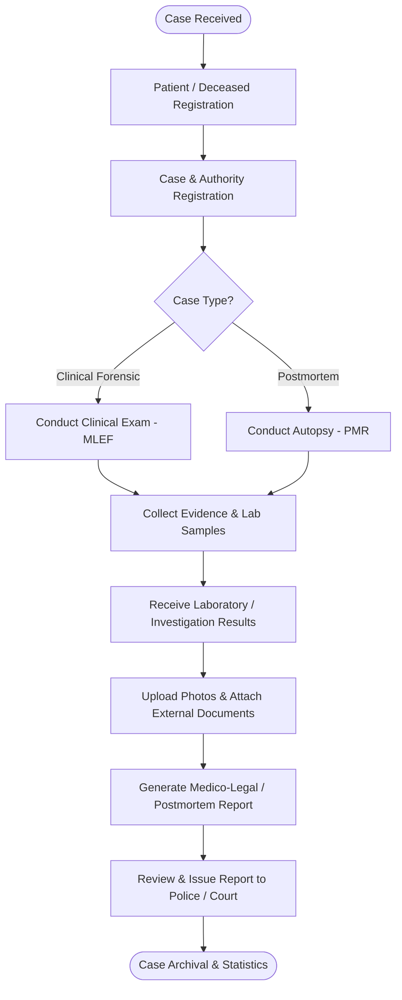

# 00_Project_Overview

This document provides a comprehensive overview of the **Forensic Medicine Department Database System (FMDDS)**. It synthesizes the project's purpose, scope, business goals, core modules, high-level workflows, and technology assumptions directly from the software requirements specification.

---

## 1. Project Purpose

The Forensic Medicine Department Database System (FMDDS) is a secure, centralized database and information management system designed to support the operational, administrative, and medico-legal activities of a forensic medicine department. 

The primary purpose of FMDDS is to digitize and replace or supplement manual, paper-based, and fragmented digital record-keeping (such as registers, spreadsheets, and manual folders). By centralizing case registration, clinical examinations, autopsies, and evidence tracking, the system improves retrieval efficiency, ensures data confidentiality, automates report preparation, and enhances statistical reporting.

---

## 2. Project Scope

The FMDDS boundaries cover two primary medico-legal components and several supporting modules within the department:

### A. Clinical Forensic Component
* **Registration of Clinical Forensic Cases**: Register living patients referred for medico-legal examinations (e.g., trauma, domestic abuse, sexual abuse, child abuse, age estimation, and drug-related cases).
* **Medico-Legal Examination Forms (MLEF)**: Manage and store structured clinical examination entries.
* **Findings Recording**: Document physical and psychological examination findings.
* **Investigations & Referrals**: Log external referrals, specialist consultations, and laboratory orders.
* **Photograph & Document Storage**: Securely attach photographic evidence and external documents.
* **Medico-Legal Report (MLR) Management**: Automate generation, review, tracking, and issuance of official MLRs to courts and police.

### B. Postmortem Component
* **Autopsy Case Registration**: Register deceased persons received for postmortem examination.
* **Inquest & Court Orders**: Document official judicial requests, police inquest reports, and court mandates.
* **Postmortem Findings Recording**: Detail external and internal autopsy findings, organ weights, and anatomical observations.
* **Cause of Death (COD) Management**: Record immediate, antecedent, and underlying causes of death, including manner of death.
* **Investigation Results**: Record toxicology, histopathology, and DNA test results from external or internal labs.
* **Postmortem Report (PMR) Management**: Automate generation, review, tracking, and issuance of PMRs.

### C. Supporting Modules
* **Patient & Deceased Management**: Core registry maintaining demographic and biographical data.
* **Evidence & Laboratory Tracking**: Manage chains of custody for physical evidence, tissue samples, and toxicology specimens.
* **Document Repository**: A central store for scanned documents, police records, and digital attachments.
* **Court & Police Report Tracking**: Record subpoena reception, court attendance dates, and report delivery receipts.
* **Dashboard & Analytical Reporting**: Generate operational indicators, case volumes, and disease/injury classifications.
* **User Authentication & Role-Based Access Control (RBAC)**: Secure access using roles like JMOs, Clerical Staff, Lab Technicians, and Admins.
* **Audit Logging & Notifications**: Log all database writes, view actions, and critical status updates.

---

## 3. Business Objectives

The business objectives defined in the SRS are as follows:

| Objective ID | Business Objective Description |
| :--- | :--- |
| **BR-001** | Digitize forensic medical record management processes. |
| **BR-002** | Improve searching and retrieval of case information. |
| **BR-003** | Enhance confidentiality and controlled access to medico-legal data. |
| **BR-004** | Improve management of evidence, reports, and supporting documents. |
| **BR-005** | Reduce manual report preparation effort through automation. |
| **BR-006** | Provide accurate statistical reporting and dashboards. |
| **BR-007** | Establish a scalable database foundation for future enhancements. |

---

## 4. High-Level Workflows

The following workflow illustrates the end-to-end lifecycle of a forensic case within the FMDDS:

---

## 5. Technology Assumptions

Based on the SRS context, design specifications, and constraints:

* **Database Architecture**: The system utilizes a Relational Database Management System (RDBMS). Supported databases are **MySQL** or **PostgreSQL** to enforce referential integrity and support structured querying.
* **Layered Design**: The architecture is assumed to follow a standard 3-Tier/Layered approach:
  * **Presentation Layer (Frontend)**: Web interface built using HTML5, CSS3, JavaScript, and responsive frameworks (e.g., Bootstrap or modern JS frameworks).
  * **Business Logic Layer (Backend)**: API endpoints (RESTful web services) built with a secure backend framework (such as ASP.NET Core, Spring Boot, or Laravel).
  * **Data Access Layer**: Standard Object-Relational Mapping (ORM) tools like Entity Framework or Hibernate to interface with the RDBMS.
* **Security & Authentication**: Identity verification using secure protocols (JWT or session-based authentication) with Role-Based Access Control (RBAC) enforced at the database and application levels.
* **Hosting**: The database is assumed to be deployed in a secure on-premise server or managed local network infrastructure within the Forensic Medicine Department to meet legal data sovereignty requirements.
