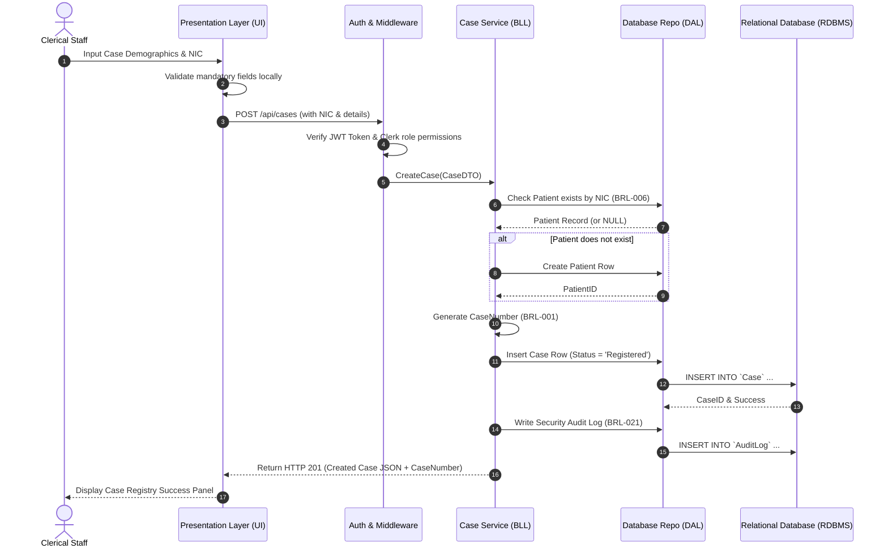
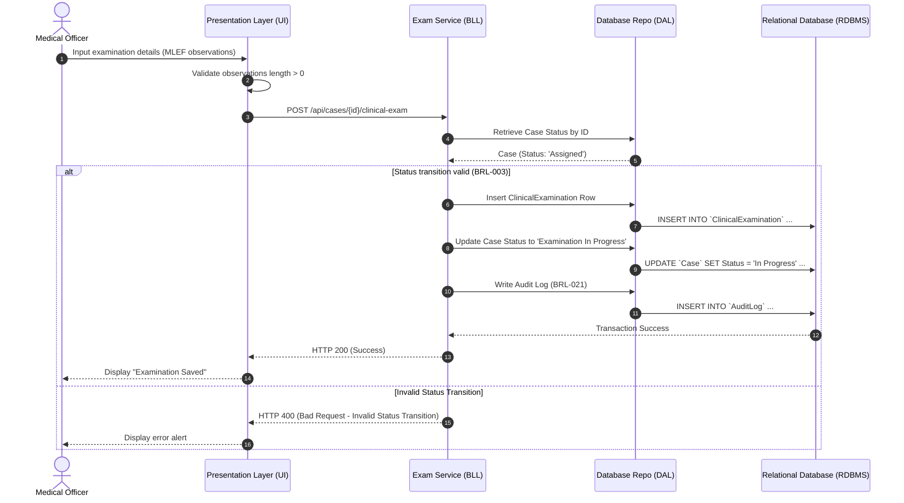
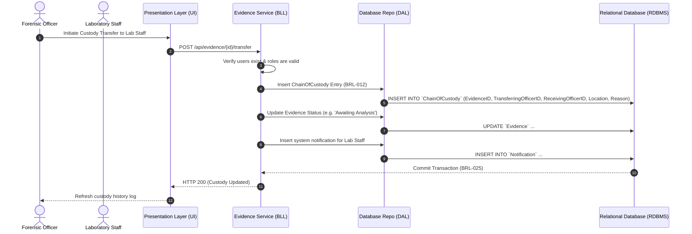

# Data Flow

This document details the flow of data through FMDDS component boundaries during key business processes, based on Sections 2.2, 7.5, and 10.2 of the SRS.

---

## 1. Case Intake & Registration Flow

This flow maps how a new medico-legal incident is ingested by a Clerk (`ROLE-006`) or Forensic Officer (`ROLE-004`), validating patient details and generating a Case Record.

---

## 2. Clinical Examination & Diagnosis Flow

This flow covers a Medical Officer (`ROLE-003`) saving clinical findings for living patients.

---

## 3. Evidence Chain of Custody Transfer Flow

Illustrates how physical evidence changes hands between Forensic Officers and Laboratory Staff.

