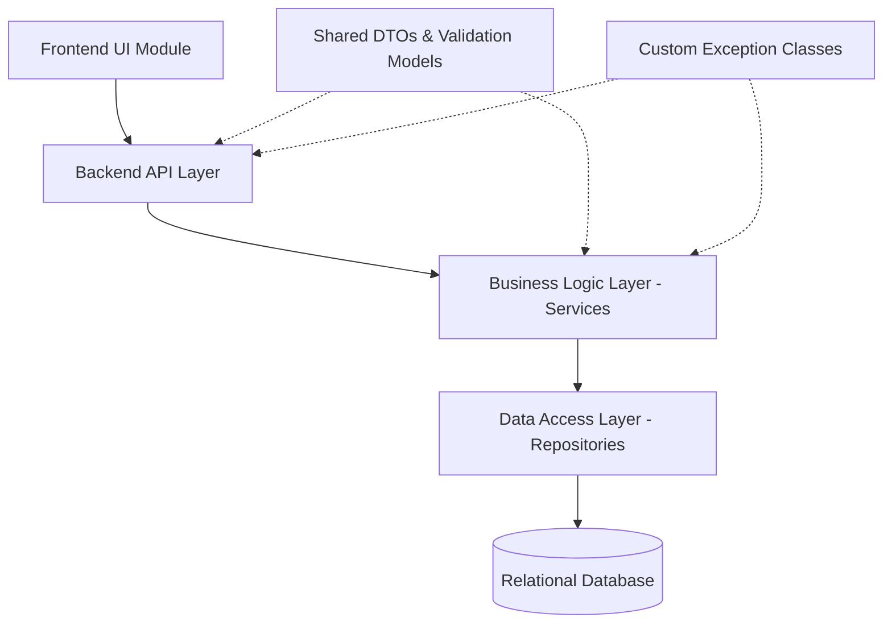

# Module Dependencies

This document maps the dependencies and compile-time boundaries between project modules in FMDDS, preventing circular references and maintaining structural integrity, based on Section 10.2.9 of the SRS.

---

## 1. Module Dependency Graph

In compliance with the Layered Architecture style, the compilation and reference directions flow downwards. Higher layers depend on lower layers, never the reverse.

---

## 2. Compile-Time Dependency Specifications

### 2.1 Frontend UI Module
* **Depends On**: Backend API HTTP contract (endpoints, request payloads, response payloads).
* **Isolation Rule**: Standard UI elements (HTML/CSS/JS files) cannot directly access DAL repositories or execute database queries.

### 2.2 Backend API Layer (Controllers)
* **Depends On**:
  * Business Logic Layer (BLL) Service Interfaces (using Dependency Injection).
  * Shared DTOs for request mapping and JSON parsing.
  * Validation rules models for incoming HTTP request parsing.
* **Isolation Rule**: Controllers must not reference database context classes or write queries directly. They delegate execution to BLL services.

### 2.3 Business Logic Layer (BLL Services)
* **Depends On**:
  * Data Access Layer (DAL) Repository Interfaces.
  * Shared DTOs for converting raw data models to domain-ready structures.
* **Isolation Rule**: BLL contains no direct SQL strings, SQL connection handlers, or database driver imports. All database interactions occur via injected repositories.

### 2.4 Data Access Layer (DAL Repositories)
* **Depends On**:
  * RDBMS drivers / ORM library models (e.g. EF Core or Eloquent context).
  * Data Entities mapping to database schemas.
* **Isolation Rule**: DAL exposes data entities and queries but executes no business workflows, authorization logic, or document generation tasks.

---

## 3. Dependency Management Rules

1. **Circular Reference Prevention**: Circular references (e.g., Module A referencing Module B, while Module B references Module A) are strictly prohibited.
2. **Interface-Based Programming**: Services and repositories must be bound through interfaces (`ICaseService`, `ICaseRepository`) registered in the backend's Dependency Injection container. This allows database engines or service implementations to be substituted without affecting adjacent layers.
3. **No Direct Entity Leaks**: Data Entities must not be returned directly by the API Controllers. They must be mapped to Data Transfer Objects (DTOs) in the BLL before reaching the Presentation Layer to protect database structure confidentiality.
