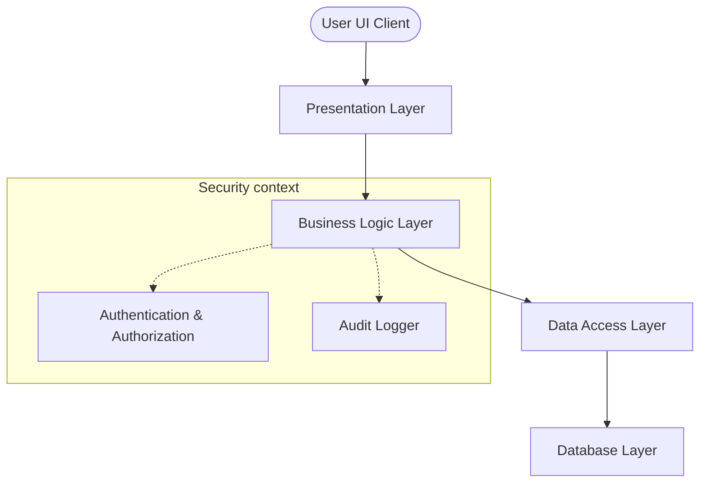

# System Architecture

This document defines the architectural style, design patterns, and software layers that guide the development of the FMDDS, based on Section 10.2 of the SRS.

---

## 1. Architectural Style: N-Tier / Layered Architecture

The FMDDS is designed using a **4-Layer (N-Tier) Architectural Style** combined with modular component principles. This decouples responsibilities, reduces code complexity, and ensures that changes in one layer (such as database migrations) do not ripple directly into the user interface.

---

## 2. Layer Responsibilities

### 2.1 Presentation Layer (Frontend Client)
* **Responsibility**: Renders user interfaces, captures user events, performs client-side field validation, and makes asynchronous HTTP requests (AJAX/Fetch) to backend API endpoints.
* **Key Patterns**: Model-View-Controller (MVC) or Component-Driven client-side routing.
* **Separation Constraint**: Must contain zero direct SQL statements or raw business calculation algorithms.

### 2.2 Business Logic Layer (BLL / Application Service)
* **Responsibility**: Evaluates business policies and validation checks (e.g., verifying status progression rules `BRL-003`), handles authorization credentials, coordinates workflow transactions, and generates report documents.
* **Key Patterns**: Services, Command/Query Separation, Dependency Injection (DI), Transaction Coordination.
* **Separation Constraint**: Communicates with the Database layer *only* through the Data Access Layer interfaces.

### 2.3 Data Access Layer (DAL)
* **Responsibility**: Abstracts relational database operations into programming language objects. Translates business queries into optimized SQL.
* **Key Patterns**: Repository Pattern, Unit of Work, Object-Relational Mapping (ORM).
* **Separation Constraint**: Translates entities into logical domain models, exposing zero RDBMS details to the service layer.

### 2.4 Database Layer (DBMS)
* **Responsibility**: Secure relational data storage, schema constraints enforcement (PK, FK, CHECK), triggers execution, and transaction isolation compliance (ACID properties).
* **Key Patterns**: Normalized schema (3NF), indexed lookups, and stored views.

---

## 3. Core System Components

The application is decomposed into the following modular domain components:

* **Authentication & User Management**: Handles logins (`UC-001`), password changes, token signing, and system user creation.
* **Case Management**: Manages intake, assignment, search, and lifecycle transitions for forensic cases (`UC-003`, `UC-005`).
* **Medical Examination Components**: Two separate modules mapping to clinical evaluations (`UC-006`) and autopsy logs (`UC-007`).
* **Evidence Module**: Tracks item registration and coordinates the chain of custody (`UC-008`).
* **Laboratory Module**: Communicates lab orders and stores toxicological/diagnostic results.
* **Reporting Module**: Assembles data and exports official reports.
* **Supporting Admin Modules**: Coordinates system audit trails and schedules automated backups.
