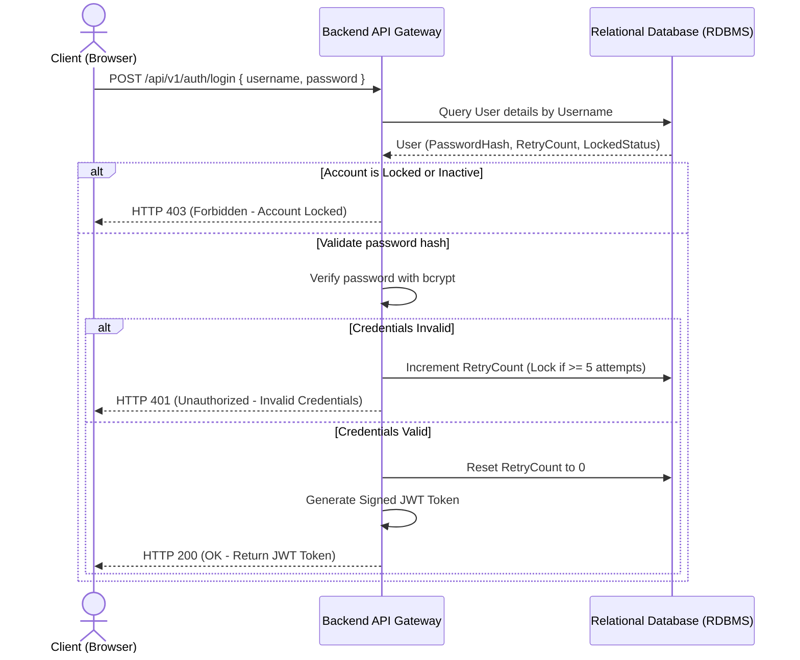

# Backend Authentication Specification

This document details the identity verification, password hashing, session management, and account lockout specifications for FMDDS, based on Sections 4.1, 8.4.3, and 8.5 of the SRS.

---

## 1. Authentication Mechanism: JSON Web Tokens (JWT)

FMDDS uses stateless JWTs to authenticate incoming client requests, satisfying `NFR-004`. 



---

## 2. JWT Structure & Schema

The signed token is returned in the HTTP Response payload and must be included in subsequent requests in the `Authorization: Bearer <token>` header.

### 2.1 JWT Header
Enforces standard cryptographical algorithms:
```json
{
  "alg": "HS256",
  "typ": "JWT"
}
```

### 2.2 JWT Payload (Claims)
Maintains identity and roles parameters for quick application-layer checks:
```json
{
  "iss": "fmdds-auth-service",
  "sub": "2",
  "name": "Dr. Silva",
  "username": "dr_silva",
  "role": "Judicial Medical Officer",
  "permissions": ["case:view_all", "exam:record_postmortem", "report:approve"],
  "iat": 1783256400,
  "exp": 1783260000
}
```
* **Token Expiration (`exp`)**: Automatically set to 1 hour from creation.

---

## 3. Session Inactivity Timeout Policy

* **Timeout Threshold**: Inactive sessions automatically expire after **15 minutes of inactivity** (`NFR-008`).
* **Implementation Strategy**:
  * **Client-Side**: The frontend application tracks mouse and keyboard events. If no user actions are detected for 15 minutes, it clears the stored token and routes the user back to the `/login` view.
  * **Server-Side**: Standard JWT expiration limits token lifetimes. Blacklists or revokes tokens upon active `/logout` requests.

---

## 4. Account Lockout Rules

To protect against brute-force dictionary attacks, user profiles are secured under `BRL-020`:
1. **Failure Threshold**: Five (5) consecutive failed login attempts locks the user account.
2. **Lockout Columns**: Implemented using fields `FailedLoginAttempts` (`INT`, default 0) and `IsLocked` (`BIT`, default `FALSE`) on the `User` table.
3. **Lockout Duration**: Accounts remain locked until manually unlocked by a **System Administrator** (`ROLE-001`) via the administrator control panel (`UC-013`).
4. **Logging**: Lockout events are registered as Critical security actions in the `AuditLog` table.

---

## 5. Password Security Rules

Passwords are protected using industry-strength hashing (`NFR-006`):
* **Hashing Algorithm**: **bcrypt** (minimum work factor = 12). Plain text passwords must never be stored in the database.
* **Complexity Requirements**:
  * Minimum length of 8 characters.
  * Must contain at least one uppercase letter, one lowercase letter, one number, and one special character (e.g., `@`, `#`, `$`, `!`).
