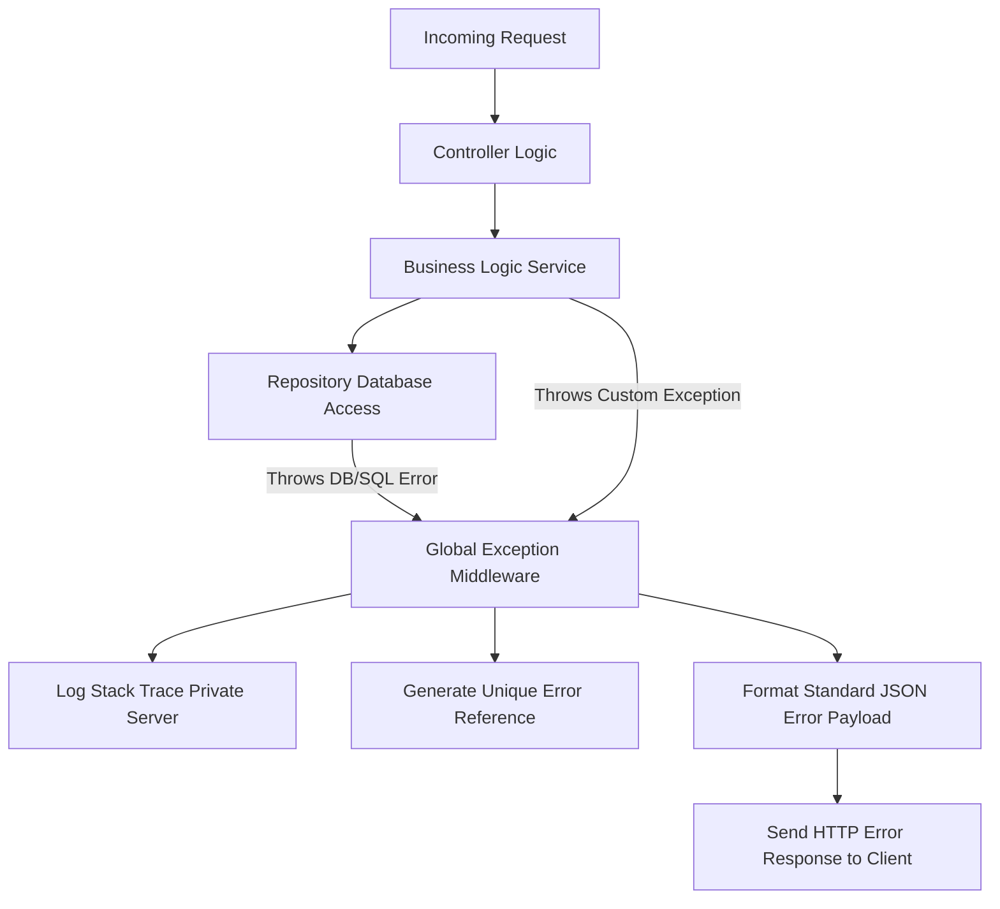

# Backend Error Handling Specification

This document defines the server-side exception handling, global error response payloads, and custom error codes implemented in FMDDS, preventing information leaks and ensuring a consistent client experience, based on Sections 2.5, 6.3, and 10.2 of the SRS.

---

## 1. Global Error Response Schema

To secure database structure details and database driver errors from client visibility, the API must return a standardized JSON error response whenever operations fail.

### 1.1 Standard Error Payload
```json
{
  "status": 400,
  "code": "ERR_INVALID_STATUS_TRANSITION",
  "message": "The requested status transition is not allowed.",
  "timestamp": "2026-07-05T12:00:00Z",
  "errorReference": "ERR-98173-FMDDS"
}
```
* **`errorReference`**: A unique UUID or timestamp-based hash mapped to the server-side diagnostics log. Standard users see this reference code, which allows system administrators to trace exact stack traces in private server logs without exposing database internals to the public client.

### 1.2 Validation Error Payload (HTTP 400)
Returned when input payloads fail schema checks:
```json
{
  "status": 400,
  "code": "ERR_SCHEMA_VALIDATION_FAILED",
  "message": "One or more input fields failed validation constraints.",
  "errors": [
    {
      "field": "nic",
      "issue": "The National Identity Card format is invalid. Must be 9 digits followed by 'V/X' or 12 digits."
    },
    {
      "field": "fullName",
      "issue": "Patient name is required."
    }
  ]
}
```

---

## 2. Custom Application Error Codes

| Error Code | HTTP Status | Description / Trigger Scenario |
| :--- | :---: | :--- |
| **`ERR_UNAUTHENTICATED`** | `401` | Missing, malformed, or expired JWT authorization header. |
| **`ERR_INSUFFICIENT_PERMISSIONS`**| `403` | User is authenticated but role lacks required authorization permission key. |
| **`ERR_ACCOUNT_LOCKED`** | `403` | User account is locked due to multiple consecutive failed attempts. |
| **`ERR_RESOURCE_NOT_FOUND`** | `404` | Requested record ID (e.g. Case, Patient, or User) does not exist. |
| **`ERR_DUPLICATE_NIC`** | `400` | Attempting to register a patient with a National ID already assigned in DB. |
| **`ERR_DUPLICATE_USERNAME`** | `400` | Attempting to create an administrator or doctor account using a taken username. |
| **`ERR_INVALID_STATUS_TRANSITION`**| `400` | Violating Case status progression rules (`BRL-003`). |
| **`ERR_CASE_CLOSED`** | `400` | Attempting to register clinical observations or laboratory requests for a Closed/Archived case. |
| **`ERR_REPORT_PENDING_LABS`** | `400` | Attempting to approve a Postmortem Report while laboratory requests are unresolved. |
| **`ERR_INTERNAL_SERVER`** | `500` | Unhandled database exceptions or system crashes. |

---

## 3. Server Exception Middleware Flow

The backend application uses a **Global Exception Handler Middleware** that catches all exceptions thrown in the controllers, services, or repository layers:


* **No Database Leak**: Raw SQL driver logs (e.g., duplicate index errors, connection failures) are swallowed by the middleware. A generic code `ERR_INTERNAL_SERVER` is sent to the client, while details are written to the secure local file log.
