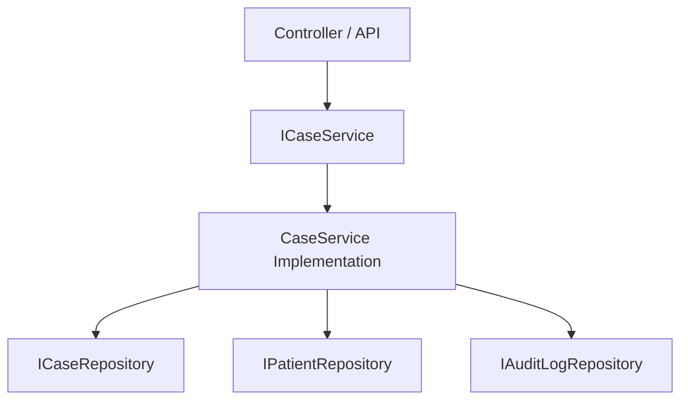

# Backend Services

This document defines the interface contracts, business validations, and repository dependencies for the backend logic services (Business Logic Layer) of FMDDS, based on Section 10.2.4 of the SRS.

---

## 1. Services Registry

To decoupling BLL from DAL, all core business logic resides in services exposing well-defined interface structures.

---

## 2. Core Service Interface Definitions

### 2.1 AuthService
Manages account login validation, password hashing, and user token creation.
* **Methods**:
  * `AuthenticateUser(username, password) ➔ TokenDTO`: Verifies if user exists and password hash matches (`PasswordHash` verified using bcrypt). Checks if account `IsActive == true`. If login fails consecutively (e.g. 5 times), locks the account (`BRL-020`). Updates the audit trail (`BRL-021`).
  * `ChangePassword(userID, oldPassword, newPassword) ➔ Boolean`: Validates password complexity strength (`NFR-006`), updates the database, and forces session resets.
  * `ResetPassword(userID) ➔ TempPassword`: Generates secure temporary password; triggers email notifications.
* **Dependencies**: `IUserRepository`, `IAuditLogRepository`, `INotificationService`.

### 2.2 CaseService
Coordinates case registry intake, demographics validation, and case status transitions.
* **Methods**:
  * `CreateCase(patientID, caseType, referralSource, referralSourceTypeID, assignedOfficerID, hospitalID, wardID) ➔ CaseDTO`:
    * Validates if `Patient` exists (`BRL-002`).
    * Validates lookup existence for `HospitalID`, `WardID`, and `ReferralSourceTypeID` if provided.
    * Generates a unique Case Number based on department formats (`BRL-001`, e.g. `COL/YYYY/TYPE/XXXX`).
    * Sets initial case status to `Registered`.
    * Creates audit log entry (`BRL-021`).
  * `SearchCases(filterDTO) ➔ List<CaseDTO>`: Executes searches using unique indexes (`IX_Case_CaseNumber`, `IX_Patient_NIC`) to satisfy `FR-006`.
  * `TransitionStatus(caseID, targetStatus) ➔ CaseDTO`:
    * Validates status transitions (`BRL-003`).
    * Bypasses the `Laboratory Pending` state automatically and routes from `Examination In Progress` directly to `Report Preparation` if no pending laboratory requests exist for the case.
    * If transitioning to `Closed`, ensures all examinations are completed, lab requests are resolved, and reports are approved (`BRL-004`).
* **Dependencies**: `ICaseRepository`, `IPatientRepository`, `IHospitalRepository`, `IWardRepository`, `IReferralSourceTypeRepository`, `IAuditLogRepository`.

### 2.3 ClinicalExamService & PostmortemService
Manages detailed medical examinations and findings records.
* **Methods**:
  * `RecordClinicalExam(caseID, examinerID, examDTO) ➔ ExamDTO`:
    * Verifies user has a `Medical Officer` or `JMO` role (`BRL-008`).
    * Validates that the case status permits exam updates (must be `Assigned` or `In Progress`).
    * Inserts observations and updates Case status to `In Progress`.
  * `RecordAutopsy(caseID, examinerID, autopsyDTO) ➔ AutopsyDTO`:
    * Verifies user has a `Judicial Medical Officer` role (`BRL-008`).
    * Ensures the case is registered under the `Postmortem` category.
    * Enforces Cause of Death (COD) fields are completed (`BRL-009`).
* **Dependencies**: `ICaseRepository`, `IClinicalExamRepository`, `IPostmortemRepository`, `IAuditLogRepository`.

### 2.4 EvidenceService
Maintains custody chain records and storage allocations.
* **Methods**:
  * `RegisterEvidence(caseID, evidenceType, description, storageLocation) ➔ EvidenceDTO`:
    * Verifies the case is currently active and not Closed/Archived.
    * Automatically logs the collecting officer as the initial custodian.
  * `TransferCustody(evidenceID, receivingOfficerID, location, reason) ➔ CustodyDTO`:
    * Validates evidence exists.
    * Verifies the transferring officer is the current custodian.
    * Enforces mandatory custody fields (`BRL-012`: Timestamp, Transferring ID, Receiving ID, Location, Reason).
    * Sends notification to the receiving user account (`FR-025`).
* **Dependencies**: `IEvidenceRepository`, `IChainOfCustodyRepository`, `IUserRepository`, `INotificationService`, `IAuditLogRepository`.

### 2.5 LaboratoryService
Coordinates external investigation requests and results compilation.
* **Methods**:
  * `CreateRequest(caseID, testType, requestedByID) ➔ LabRequestDTO`: Validates Case exists and is active (`BRL-014`). Creates request with status `Pending`.
  * `RecordResults(requestID, resultText, completedByID) ➔ LabResultDTO`:
    * Verifies lab result user role (`ROLE-005`).
    * Updates request status to `Completed`.
    * Inserts results and logs completion timestamp (`BRL-015`).
    * Notifies the assigned JMO that lab reports are ready (`FR-025`).
* **Dependencies**: `ILabRequestRepository`, `ILabResultRepository`, `ICaseRepository`, `INotificationService`.

### 2.6 ReportService
Assembles and archives legal medico-legal documentation.
* **Methods**:
  * `GenerateDraftReport(caseID, reportType) ➔ ReportDTO`: Compiles patient details, examinations findings, and finalized lab results into templates (`FR-019`).
  * `ApproveReport(reportId, JMOID) ➔ ReportDTO`:
    * Verifies JMO credentials (`BRL-016`).
    * Ensures all exams and lab requests for the case are completed (`BRL-010`).
    * Updates report status to `Approved`.
    * Locks the report and case records as read-only (`BRL-017`).
* **Dependencies**: `IMedicoLegalReportRepository`, `ICaseRepository`, `IAuditLogRepository`.
