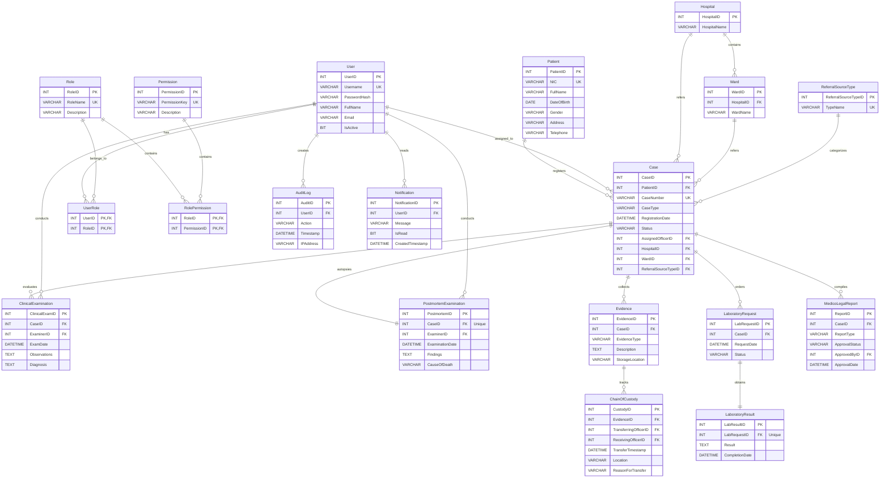

# Entity Relationship Diagram (ERD)

This document presents the visual database schema model using Mermaid ER syntax, representing the logical structure, primary keys, foreign keys, and attributes as defined in Section 7.4 of the SRS.

---

## 1. High-Level Entity Relationship Diagram (ERD)

---

## 2. Diagram Key & Notation Guide

The notation follows standard crow's foot notation:
* `||--o{` : One-to-Many (Optional on child side, mandatory on parent side).
* `||--||` : One-to-One (Mandatory on both sides).
* `PK` : Primary Key.
* `FK` : Foreign Key.
* `UK` : Unique Key constraint.
* `FK "Unique"`: Implements a 1:1 relationship by placing a unique constraint on the foreign key column.
