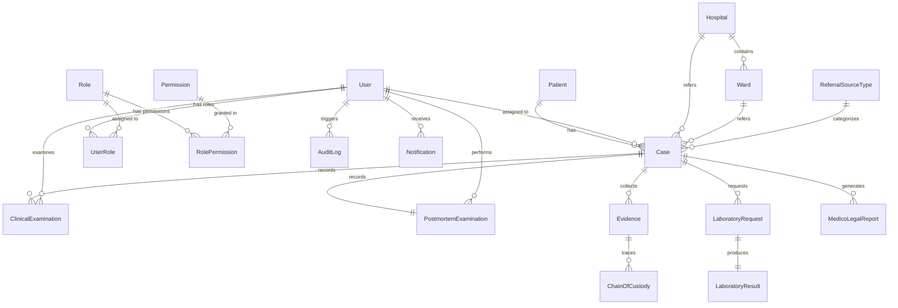

# Database Relationships

This document defines the relationships between database entities, detailing their cardinalities, foreign key connections, and referential integrity constraints, based on Section 9.2, 9.3, and 9.4 of the SRS.

---

## 1. Relationships Map

The following relationships represent the structural bounds of the FMDDS relational schema.

---

## 2. Detailed Relationships Specification

### 2.1 Patient ➔ Case
* **Cardinality**: One-to-Many (1:M)
* **Parent Table**: `Patient` (`PatientID`)
* **Child Table**: `Case` (`PatientID`)
* **Referential Action**:
  * `ON DELETE RESTRICT` (A patient/deceased record cannot be deleted if a case is linked to it).
  * `ON UPDATE CASCADE`
* **Business Meaning**: A single Patient (living patient or deceased person) may be associated with multiple medico-legal incidents over time.

### 2.2 Case ➔ ClinicalExamination
* **Cardinality**: One-to-Many (1:M)
* **Parent Table**: `Case` (`CaseID`)
* **Child Table**: `ClinicalExamination` (`CaseID`)
* **Referential Action**:
  * `ON DELETE CASCADE` (If a clinical case record is removed, its associated examinations are removed).
  * `ON UPDATE CASCADE`
* **Business Meaning**: A clinical case collects medical evaluations. (Though logically a case typically has one primary clinical examination, multiple supplementary examination entries may be recorded).

### 2.3 Case ➔ PostmortemExamination
* **Cardinality**: One-to-One (1:1)
* **Parent Table**: `Case` (`CaseID`)
* **Child Table**: `PostmortemExamination` (`CaseID` - acts as a Unique Foreign Key)
* **Referential Action**:
  * `ON DELETE CASCADE`
  * `ON UPDATE CASCADE`
* **Business Meaning**: A deceased person's case is associated with exactly one postmortem autopsy examination.

### 2.4 Case ➔ Evidence
* **Cardinality**: One-to-Many (1:M)
* **Parent Table**: `Case` (`CaseID`)
* **Child Table**: `Evidence` (`CaseID`)
* **Referential Action**:
  * `ON DELETE RESTRICT` (Evidence cannot be orphaned; a case cannot be deleted if it has registered evidence).
  * `ON UPDATE CASCADE`
* **Business Meaning**: Multiple physical or biological evidence items may be collected and registered under a single forensic case.

### 2.5 Evidence ➔ ChainOfCustody
* **Cardinality**: One-to-Many (1:M)
* **Parent Table**: `Evidence` (`EvidenceID`)
* **Child Table**: `ChainOfCustody` (`EvidenceID`)
* **Referential Action**:
  * `ON DELETE CASCADE`
  * `ON UPDATE CASCADE`
* **Business Meaning**: To trace the chain of custody, every transfer of a registered evidence item generates an audit trail log linked back to that item.

### 2.6 Case ➔ LaboratoryRequest
* **Cardinality**: One-to-Many (1:M)
* **Parent Table**: `Case` (`CaseID`)
* **Child Table**: `LaboratoryRequest` (`CaseID`)
* **Referential Action**:
  * `ON DELETE RESTRICT`
  * `ON UPDATE CASCADE`
* **Business Meaning**: A single case may require multiple laboratory requests (e.g., Toxicology, Histopathology, and DNA tests).

### 2.7 LaboratoryRequest ➔ LaboratoryResult
* **Cardinality**: One-to-One (1:1)
* **Parent Table**: `LaboratoryRequest` (`LabRequestID`)
* **Child Table**: `LaboratoryResult` (`LabRequestID` - acts as a Unique Foreign Key)
* **Referential Action**:
  * `ON DELETE CASCADE` (Deleting an investigation request automatically removes its results).
  * `ON UPDATE CASCADE`
* **Business Meaning**: Each specific laboratory request produces exactly one finalized set of test results.

### 2.8 Case ➔ MedicoLegalReport
* **Cardinality**: One-to-Many (1:M)
* **Parent Table**: `Case` (`CaseID`)
* **Child Table**: `MedicoLegalReport` (`CaseID`)
* **Referential Action**:
  * `ON DELETE RESTRICT`
  * `ON UPDATE CASCADE`
* **Business Meaning**: A case can generate multiple document reports (e.g., preliminary postmortem findings and a final approved Postmortem Report).

### 2.9 Hospital ➔ Ward
* **Cardinality**: One-to-Many (1:M)
* **Parent Table**: `Hospital` (`HospitalID`)
* **Child Table**: `Ward` (`HospitalID`)
* **Referential Action**:
  * `ON DELETE CASCADE` (Deleting a hospital removes all nested wards).
  * `ON UPDATE CASCADE`
* **Business Meaning**: A referring hospital contains multiple functional wards (e.g. Ward 10, ICU) for nesting and categorizing patient transfers.

### 2.10 Hospital / Ward ➔ Case
* **Cardinality**: One-to-Many (1:M)
* **Parent Tables**: `Hospital` (`HospitalID`), `Ward` (`WardID`)
* **Child Table**: `Case` (`HospitalID`, `WardID`)
* **Referential Action**:
  * `ON DELETE RESTRICT` (A hospital or ward lookup entry cannot be deleted if referenced in active cases).
  * `ON UPDATE CASCADE`
* **Business Meaning**: A case may optional link back to the referring hospital and ward where the patient was treated before forensic examination.

### 2.11 ReferralSourceType ➔ Case
* **Cardinality**: One-to-Many (1:M)
* **Parent Table**: `ReferralSourceType` (`ReferralSourceTypeID`)
* **Child Table**: `Case` (`ReferralSourceTypeID`)
* **Referential Action**:
  * `ON DELETE RESTRICT`
  * `ON UPDATE CASCADE`
* **Business Meaning**: Categorizes referring channels (such as Police, Magistrate Court, Hospital, or Institutional Service Department (ISD)).

---

## 3. User & Authentication Relationships

### 3.1 User ➔ UserRole ➔ Role
* **Cardinality**: Many-to-Many (M:N)
* **Resolve Table**: `UserRole` mapping `UserID` and `RoleID`.
* **Referential Action**:
  * `ON DELETE CASCADE` (Removing a user or role automatically deletes its mapping records).
  * `ON UPDATE CASCADE`

### 3.2 Role ➔ RolePermission ➔ Permission
* **Cardinality**: Many-to-Many (M:N)
* **Resolve Table**: `RolePermission` mapping `RoleID` and `PermissionID`.
* **Referential Action**:
  * `ON DELETE CASCADE`

### 3.3 User ➔ Case / ClinicalExamination / PostmortemExamination
* **Role assignment and tracking**:
  * `User.UserID` (Officer/Doctor) linked to `Case.AssignedOfficerID` (1:M).
  * `User.UserID` (Examiner) linked to `ClinicalExamination.ExaminerID` (1:M).
  * `User.UserID` (Examiner) linked to `PostmortemExamination.ExaminerID` (1:M).
* **Referential Action**:
  * `ON DELETE SET NULL` or `ON DELETE RESTRICT` (A user account deletion must not delete history; JMOs or Officers cannot be deleted if active cases or examinations are linked to them).
