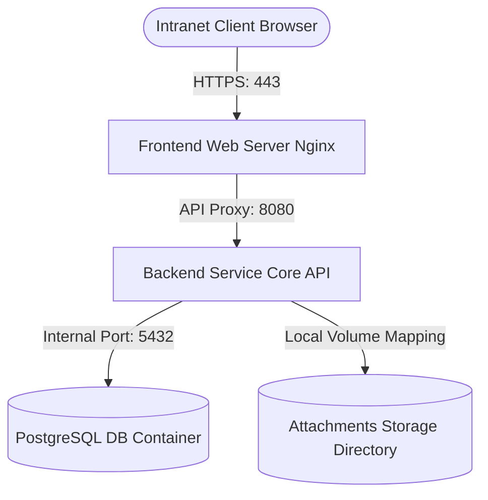

# Deployment Specifications

This document outlines the hosting environment, system requirements, Dockerization setup, and step-by-step production installation instructions for FMDDS, based on Sections 2.4.5, 3.4, and 13 of the SRS.

---

## 1. Hosting Environment & Requirements

FMDDS is deployed as a **Single Department Deployment** (`ASM-2.4-001`) hosted on a local intranet server within the Forensic Medicine Department to comply with legal network constraints (`DC-004`).

### 1.1 Recommended Server Hardware Specifications
* **CPU**: Quad-Core Intel Xeon or AMD EPYC (2.5 GHz minimum).
* **RAM**: 16 GB DDR4.
* **Storage**: 500 GB SSD (RAID-1 configuration recommended for operating system and database), plus a 2 TB secondary HDD or Network Attached Storage (NAS) mapping for clinical image attachments and backups.
* **Operating System**: Linux (Ubuntu Server 22.04 LTS or Rocky Linux 9).

### 1.2 Network Infrastructure
* Hosted behind a department firewall.
* Access is restricted to intranet IP ranges. Remote access is permitted only via secure institutional VPN connections.
* Port 80 (HTTP) redirected to Port 443 (HTTPS) carrying valid SSL certificates.

---

## 2. Docker Containers Architecture (Docker Compose)

The system is containerized to ensure identical development, staging, and production runtimes (`NFR-021`). A multi-container `docker-compose.yml` orchestrates three services:



---

## 3. Installation & Deployment Guide

Follow these steps to deploy FMDDS on a clean Linux production host.

### Step 1: Clone Repository & Create Environment Configuration
Create the production environment file at `/deployment/env/.env.production` (see `Deployment/Environment.md` for specific variables list).

### Step 2: Build & Launch Docker Containers
From the repository root, run the Docker Compose commands:
```bash
# Build and download necessary service containers
docker-compose -f deployment/docker/docker-compose.yml build

# Start services in the background (detached mode)
docker-compose -f deployment/docker/docker-compose.yml up -d
```

### Step 3: Run Database Migrations & Seeds
Once database containers are fully initialized (approx. 10 seconds), apply DDL scripts and seed initial admin accounts:
```bash
# Execute backend ORM migrations
docker-compose -f deployment/docker/docker-compose.yml exec backend npm run db:migrate

# Seed initial roles, permissions, and initial JMO accounts
docker-compose -f deployment/docker/docker-compose.yml exec backend npm run db:seed
```

### Step 4: Verify Deployment Status
Check if all containers are healthy:
```bash
docker-compose -f deployment/docker/docker-compose.yml ps
```
The output should report `Up (healthy)` for `frontend`, `backend`, and `db` services. Navigate to `https://<server_intranet_ip>` inside a supported browser to test login.
