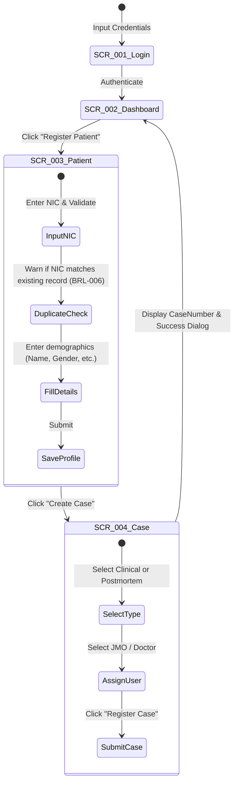

# Frontend Workflows

This document specifies the step-by-step user interaction workflows on frontend screens to execute key forensic business operations, based on Section 3.1 and Section 7.1 of the SRS.

---

## 1. Case Intake & Registration Workflow
* **User Actor**: Clerical Staff (`ROLE-006`)
* **Goal**: Register a patient and create their medico-legal case file.
* **Work Flow**:

---

## 2. Clinical Forensic Examination Workflow
* **User Actor**: Medical Officer (`ROLE-003`)
* **Goal**: Record clinical forensic examination findings for a living patient.
* **Work Flow**:
  1. **Locate Case**: From `SCR_002_Dashboard` or `SCR_010_Search`, filter cases by status `Assigned` and select the target Case.
  2. **Intake Page**: The browser displays `SCR_005_ClinicalExamination` screen with case demographics pre-loaded in the read-only header.
  3. **Observations Entry**:
     * In the "History" tab, document details of the incident.
     * In the "Physical Findings" tab, log clinical examinations observations.
     * In the "Attachments" tab, upload photographs of injuries (validation checks file format).
  4. **Diagnosis**: Enter clinical diagnosis.
  5. **Submit**: Click the "Submit Examination" button. The system validates that observations and doctor ID are present (`BRL-007`).
  6. **Completion**: Case status transitions to `Report Preparation` in the background.

---

## 3. Postmortem Autopsy Workflow
* **User Actor**: Judicial Medical Officer (`ROLE-002`)
* **Goal**: Document autopsy findings and causes of death.
* **Work Flow**:
  1. **Case Selection**: JMO views the dashboard, clicks "Pending Autopsies", and selects the target deceased case.
  2. **Autopsy Form (`SCR_006_PostmortemExamination`)**:
     * **Section 1**: JMO reviews attached police inquest data and scanned judicial orders.
     * **Section 2**: Enters external examination observations.
     * **Section 3**: Enters internal organs autopsy data.
     * **Section 4**: Selects and documents the Cause of Death (COD).
  3. **Submit**: Click "Save Findings". The system validates that findings and COD fields are not empty (`BRL-009`, `BRL-010`).
  4. **Investigation Request (Optional)**: If toxicological analysis is required, click "Order Laboratory Test", select test parameters, and submit a lab request. Case status transitions to `Laboratory Pending`.

---

## 4. Laboratory Request & Results Recording Workflow
* **User Actor**: Laboratory Staff (`ROLE-005`)
* **Goal**: Record laboratory test findings for specimens.
* **Work Flow**:
  1. **Lab Dashboard**: Lab Technician logs in, landing on a queue of pending lab orders.
  2. **Select Order**: Click on a pending test item to display `SCR_007_InvestigationManagement`.
  3. **Update Status**: Click "Mark as Received". Status updates to `Processing` in the database.
  4. **Input Results**: Enter testing values and measurements in the text area. Upload the signed PDF analysis sheet.
  5. **Finalize**: Click "Submit Results". JMO is notified automatically.

---

## 5. Report Signing & Issuance Workflow
* **User Actor**: Judicial Medical Officer (`ROLE-002`)
* **Goal**: Generate and sign the final medico-legal report (MLR or PMR) to lock it for court submission.
* **Work Flow**:
  1. **Queue**: JMO navigates to "Reports Pending Approval" queue.
  2. **Review Screen (`SCR_011_ReportGeneration`)**: JMO previews the automatically generated PDF report incorporating case details, findings, and lab results.
  3. **Verify Compliance**: JMO verifies all sections are complete. If not, selects "Reject" to return to draft state.
  4. **Sign Off**: Click "Approve and Sign". The JMO enters credentials as a digital signature.
  5. **Immutability Lock**: The report status changes to `Approved`. The screen locks as read-only.
