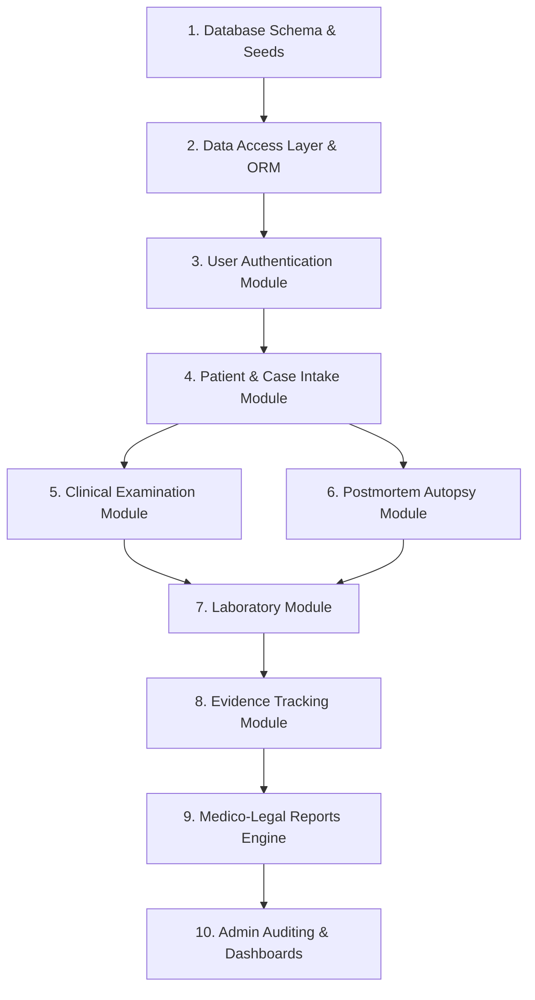

# Module Implementation Order

This document defines the strict, dependency-driven sequence for building and integrating the FMDDS modules, based on Sections 8.2.3, 9.2.4, and 10.2 of the SRS.

---

## 1. Development Sequence Map

To prevent development rework, modules are built from the database layer upwards. Testing must pass for each module before dependencies of higher modules are implemented.

---

## 2. Granular Module Build Specifications

### Step 1: Database Schema & Seed Data
* **Inputs**: Entities (`Database/Entities.md`), constraints (`Database/Constraints.md`), views (`Database/Views.md`).
* **Actions**: Write SQL DDL schemas and seed lookup data (`Database/SeedData.md`). Establish database users and least-privilege permissions.
* **Success Criteria**: Schema complies with 3NF. Basic lookup queries run successfully.

### Step 2: Data Access Layer (DAL) & ORM
* **Inputs**: SQL database connection, Entity Framework or Eloquent ORM.
* **Actions**: Generate ORM entity classes. Code repository classes exposing database operations.
* **Success Criteria**: Automated unit tests verify CRUD actions on all base tables without exceptions.

### Step 3: User Authentication & Security Middleware
* **Inputs**: `User` and `Role` entities. Hashing libraries.
* **Actions**: Implement login/logout API endpoints, password validation rules, JWT token generation, and the token verification middleware.
* **Success Criteria**: System rejects unauthorized API requests with `HTTP 401`. Password hashes are verified in DB.

### Step 4: Patient & Case Intake Module
* **Inputs**: `Patient` and `Case` tables.
* **Actions**: Form interfaces for demographics entries. Implementation of validation rules (e.g. NIC regex format checking). API endpoints for case registrations.
* **Success Criteria**: Submitting a case generates a unique Case Number and inserts a transaction.

### Step 5: Clinical Examination Module
* **Inputs**: Case Module, `ClinicalExamination` table.
* **Actions**: Form interfaces for observations narrative and photo file uploads. Validates examiner role (`BRL-008`).
* **Success Criteria**: Clinical evaluations save successfully, transitioning Case status to `In Progress`.

### Step 6: Postmortem Autopsy Module
* **Inputs**: Case Module, `PostmortemExamination` table.
* **Actions**: Autopsy form entry layout. Cause of Death (COD) validation checks.
* **Success Criteria**: Autopsy details and COD successfully persist.

### Step 7: Laboratory Module
* **Inputs**: Case Module, `LaboratoryRequest` and `LaboratoryResult` tables.
* **Actions**: Create lab orders, build result record inputs. Send notification prompts to doctors.
* **Success Criteria**: Lab results successfully link to requests and resolve status dependencies.

### Step 8: Evidence Tracking Module
* **Inputs**: Case Module, `Evidence` and `ChainOfCustody` tables.
* **Actions**: Evidence entry panel. Handlers for log custody transfers, recording date/time and transfer reasons.
* **Success Criteria**: Custody trace lists the entire sequence of handlers.

### Step 9: Medico-Legal Reports Engine
* **Inputs**: Clinical and Postmortem data, lab outcomes. PDF libraries.
* **Actions**: Report compile service. Preview panel. JMO digital approval action.
* **Success Criteria**: Reports lock as read-only PDF sheets (`BRL-017`).

### Step 10: Admin Auditing & Dashboards
* **Inputs**: `AuditLog` table, views statistics.
* **Actions**: Admin audit grid page, summary dashboard dashboard charts.
* **Success Criteria**: Logging records all changes. Metrics calculate accurately.
