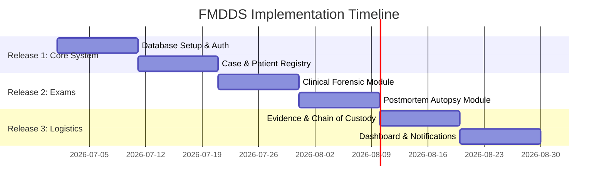

# Implementation Roadmap

This document outlines the incremental release timeline and roadmap for the FMDDS project, based on Section 2.2 of the SRS.

---

## 1. Release Timeline Overview

The FMDDS is implemented across **three primary releases** to support Agile feedback cycles and ensure that the database and security core are verified before medical data forms are loaded.

---

## 2. Release Detail Specifications

### Phase 1: Release 1 (Core System Foundation)
* **Goal**: Establish relational database tables, deploy security authentication APIs, and implement intake registration panels.
* **Features Included**:
  * **Authentication & Profiles**: Login (`SCR-001`), password management, session limits (`NFR-008`), and lockout controllers (`BRL-020`).
  * **User Administration**: Create/deactivate accounts, assign permissions, and build database security rules (`BRL-019`).
  * **Patient Registry**: Basic demographics forms (`SCR-003`) and duplicate NIC detection validation rules (`BRL-006`).
  * **Case Registry**: Open new Case sheets (`SCR-004`), generate Case Numbers, and map JMO assignees.
  * **Traceability Requirement**: Database must satisfy 3NF normalization.

### Phase 2: Release 2 (Examiner Data Modules)
* **Goal**: Enable clinical documentation for living patients, autopsy observations for deceased persons, and automated document compiles.
* **Features Included**:
  * **Clinical Forensic Module**: Log MLEF examination notes, lacerations/bruises details, and upload photographic attachments (`SCR-005`).
  * **Postmortem Module**: Enforce autopsy findings logging, internal organ tables, and mandatory Causes of Death (COD) records (`SCR-006`).
  * **Draft Report Engine**: Assemble case demographics and findings into official document templates (`SCR-011`).

### Phase 3: Release 3 (Logistics, Auditing & UI Dashboards)
* **Goal**: Track physical evidence custody, deploy lab result recording views, audit activities, and display dashboard charts.
* **Features Included**:
  * **Evidence & Chain of Custody**: Register evidence packages, log transfer custody receipts, and update safe locker indices (`SCR-008`).
  * **Laboratory Module**: Manage diagnostic request states (`Pending` ➔ `Processing` ➔ `Completed`) and save lab findings.
  * **Audit Log Viewer**: Admin panel to review security events (`SCR-013`).
  * **Dashboard**: Visual indicators tracking open cases, pending reports, and lab queues (`SCR-002`).

### Future Releases
* **Scope**:
  * Barcode scanning support for laboratory specimens.
  * Integration with external hospital HIS / LIS databases.
  * Digital signature certificates for JMO report approvals.
