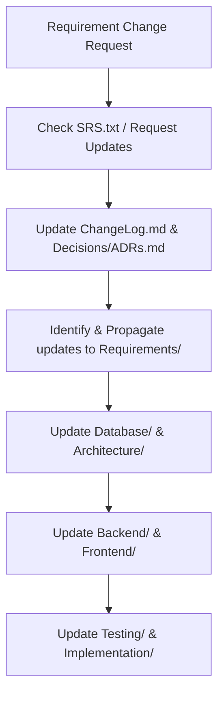

# Forensic Medicine Department Database System (FMDDS) - Project Knowledge Base

Welcome to the Project Knowledge Base for the Forensic Medicine Department Database System (FMDDS). This repository contains the structured, implementation-ready documentation serving as the primary source of truth for the project.

## Document Structure & Relationship Map

```text
Project/
│
├── README.md                    <-- You are here (map & maintenance guide)
├── 00_Project_Overview.md       <-- High-level objectives, scope, & workflows
│
├── Requirements/                <-- What the system must do (FRs, NFRs, Business Rules)
│   ├── Functional.md
│   ├── NonFunctional.md
│   ├── BusinessRules.md
│   ├── UserRoles.md
│   ├── UseCases.md
│   └── Glossary.md
│
├── Database/                    <-- Logical and physical database design
│   ├── Entities.md
│   ├── Relationships.md
│   ├── ERDiagram.md
│   ├── Constraints.md
│   ├── Normalization.md
│   ├── Indexes.md
│   ├── Views.md
│   └── SeedData.md
│
├── Architecture/                <-- High-level system structure and design
│   ├── SystemArchitecture.md
│   ├── FolderStructure.md
│   ├── TechnologyStack.md
│   ├── DataFlow.md
│   └── ModuleDependencies.md
│
├── Backend/                     <-- Server-side specification
│   ├── API.md
│   ├── Services.md
│   ├── Authentication.md
│   ├── Authorization.md
│   ├── Security.md
│   ├── Validation.md
│   └── ErrorHandling.md
│
├── Frontend/                    <-- Client-side user interface
│   ├── Screens.md
│   ├── Workflows.md
│   ├── Navigation.md
│   └── UIComponents.md
│
├── Implementation/              <-- Project roadmap and task tracking
│   ├── Roadmap.md
│   ├── ModuleOrder.md
│   ├── TaskBreakdown.md
│   └── Progress.md
│
├── Testing/                     <-- Test cases and traceability
│   ├── TestCases.md
│   ├── UnitTesting.md
│   ├── IntegrationTesting.md
│   └── AcceptanceTesting.md
│
├── Deployment/                  <-- Operations and release info
│   ├── Deployment.md
│   ├── Environment.md
│   └── BackupRecovery.md
│
└── Decisions/                   <-- Architecture logs and requirement changes
    ├── ADRs.md
    └── ChangeLog.md
```

---

## File Registry & Purposes

### Root Files
* **[README.md](file:///c:/01%20(My%20Drive)/Engineering%20Resources/4th%20Sem/CO2050%20-%20Database%20Systems/Project/Project/README.md)**: Describes the structure, purpose of files, and how to maintain the Knowledge Base.
* **[00_Project_Overview.md](file:///c:/01%20(My%20Drive)/Engineering%20Resources/4th%20Sem/CO2050%20-%20Database%20Systems/Project/Project/00_Project_Overview.md)**: Synthesizes high-level project information including scope, system boundaries, and main workflows.

### 1. Requirements/
Maps the user and system requirements from the SRS into targeted technical views:
* **Functional.md**: Exact list of system functional requirements (FRs) traceable to code modules.
* **NonFunctional.md**: Specific quality attributes (NFRs) like security, performance, and usability.
* **BusinessRules.md**: Rigorous logic policies (BRs) governing data entries, forensics procedures, and department workflows.
* **UserRoles.md**: User profiles (e.g., Doctors, Forensic Officers, Clerks, Admins) and their associated access levels.
* **UseCases.md**: Detailed descriptions of primary interactions with the system.
* **Glossary.md**: Definition of technical, medical, legal, and department-specific terminology.

### 2. Database/
Defines the relational schema design based on the requirements:
* **Entities.md**: Descriptions, tables, and column attributes.
* **Relationships.md**: Cardinality and foreign key relationships.
* **ERDiagram.md**: Graphical representation of the database schema (using Mermaid/text specifications).
* **Constraints.md**: PK, FK, Unique, Not Null, and Check constraints.
* **Normalization.md**: Formal normalization reports proving schema state (1NF, 2NF, 3NF, BCNF).
* **Indexes.md**: Recommended indexes to optimize search queries.
* **Views.md**: Standard views for reporting and dashboard queries.
* **SeedData.md**: Mock/seed data definitions for development and test suites.

### 3. Architecture/
Outlines the structural blueprints of the system:
* **SystemArchitecture.md**: Layered or modular architectural patterns.
* **FolderStructure.md**: Practical code directory structure.
* **TechnologyStack.md**: Approved languages, databases, servers, frameworks, and tools.
* **DataFlow.md**: How data transits through the user interface, backend APIs, and the database.
* **ModuleDependencies.md**: Visual dependency graphs showing import orders and modules.

### 4. Backend/
Detailing the server-side components:
* **API.md**: REST/GraphQL endpoint specifications, payloads, and response structures.
* **Services.md**: Internal business logic services and procedures.
* **Authentication.md**: Sign-in, token handling, session management, and multi-factor auth details.
* **Authorization.md**: Role-based access control (RBAC) rules mapped to backend API paths.
* **Security.md**: Encryption, data masking, and sanitization standards.
* **Validation.md**: Request payload validation constraints.
* **ErrorHandling.md**: Global error codes and exceptions representation.

### 5. Frontend/
Client-side representation of the software:
* **Screens.md**: Screen list, layout definitions, and wireframe descriptions.
* **Workflows.md**: Step-by-step user-screen interactions.
* **Navigation.md**: Application routing and user flows.
* **UIComponents.md**: Reusable component catalog (tables, buttons, inputs).

### 6. Implementation/
Tracking project execution:
* **Roadmap.md**: Chronological development phases.
* **ModuleOrder.md**: Strict dependency-based build sequence.
* **TaskBreakdown.md**: Granular checklists per module.
* **Progress.md**: Living progress tracking board.

### 7. Testing/
Verification patterns:
* **TestCases.md**: Functional test matrix mapped directly to Requirements.
* **UnitTesting.md**: Unit test scopes for database schemas and API endpoints.
* **IntegrationTesting.md**: Workflow validation testing boundaries.
* **AcceptanceTesting.md**: Formal criteria for user sign-off.

### 8. Deployment/
Operational guidelines:
* **Deployment.md**: Step-by-step setup on target host environments.
* **Environment.md**: Config parameters and secrets.
* **BackupRecovery.md**: Disaster recovery schedules and restore procedures.

### 9. Decisions/
Context and change logging:
* **ADRs.md**: Architecture Decision Records detailing design decisions.
* **ChangeLog.md**: Sequential listing of updates made to requirements or code.

---

## Maintenance & Evolution Workflow

As the project evolves, the relationship between these documents must be strictly preserved. Follow this process when requirements change:



1. **Knowledge Base as Authority**: The Markdown files within this Project Knowledge Base serve as the primary source of truth. Any changes in system requirements or database design must be updated directly in these documents first.
2. **Traceability**: If a database constraint changes, corresponding documents in `Database/`, `Requirements/BusinessRules.md`, `Backend/Validation.md`, and `Testing/TestCases.md` must be updated in sync.
3. **Changelog Tracking**: Every change must be logged in `Decisions/ChangeLog.md` specifying which files were modified.
