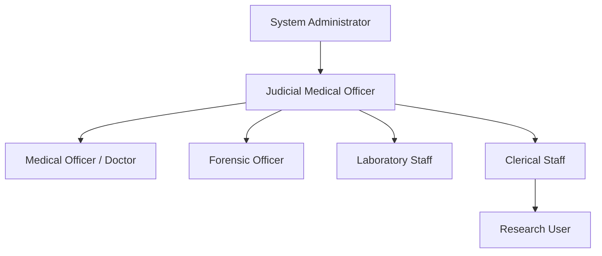

# User Roles and Permissions

This document defines the user classes, access permissions, responsibilities, and characteristics of the individuals interacting with the Forensic Medicine Department Database System (FMDDS), in accordance with Section 2.3 of the SRS.

---

## 1. Access Hierarchy & Permissions Matrix

Access control in FMDDS is governed by the **Principle of Least Privilege** using Role-Based Access Control (RBAC).

---

## 2. User Classes Directory

### 2.1 ROLE-001: System Administrator
* **Description**: Responsible for configuring, maintaining, and monitoring the system.
* **Privilege Level**: Highest
* **Technical Competency**: Advanced
* **Frequency of Use**: Daily
* **Core Responsibilities**:
  * Create, modify, activate/deactivate, and logically delete user accounts.
  * Assign user roles, permissions, and group memberships.
  * Configure system lookup tables, parameters, and metadata.
  * Manage database backups, optimization, and system recovery.
  * Monitor application performance, errors, and system audit logs.
* **Special Constraints**:
  * Cannot view or modify clinical or postmortem medical records unless explicitly authorized for a troubleshooting case (and such access is heavily logged).

### 2.2 ROLE-002: Judicial Medical Officer (JMO)
* **Description**: Primary users responsible for conducting and overseeing forensic examinations, autopsies, and legal report approvals.
* **Privilege Level**: High
* **Technical Competency**: Intermediate
* **Frequency of Use**: Very High (Continuous)
* **Core Responsibilities**:
  * Register, edit, and review complex medico-legal cases.
  * Conduct and record clinical forensic examination findings (MLEF) and postmortem autopsy findings (PMR).
  * Record provisional and final causes of death (COD).
  * Review laboratory test results, external reports, and attached photographic evidence.
  * Electronically sign and approve final medico-legal reports (MLRs and PMRs).
* **Special Constraints**:
  * Authorized to view and edit all case data across the department.
  * Sole role allowed to officially approve reports for court submission.

### 2.3 ROLE-003: Medical Officer (MO) / Doctor
* **Description**: Assists in clinical examinations and records preliminary medico-legal data.
* **Privilege Level**: High
* **Technical Competency**: Intermediate
* **Frequency of Use**: High
* **Core Responsibilities**:
  * Register clinical examinations.
  * Record clinical forensic findings.
  * Upload supporting documentation and photographs.
  * View investigation results.
  * Prepare drafts of Medico-Legal Reports (MLR) for JMO review.
* **Special Constraints**:
  * Cannot approve final reports.
  * Has write access to clinical modules, but read-only access to postmortem modules (unless co-assigned to an autopsy case).

### 2.4 ROLE-004: Forensic Officer
* **Description**: Handles case registration, physical evidence handling, and forensic photography.
* **Privilege Level**: Medium
* **Technical Competency**: Intermediate
* **Frequency of Use**: Very High (Continuous)
* **Core Responsibilities**:
  * Perform initial patient, deceased, and case registrations.
  * Register forensic evidence items and specimens.
  * Record and sign off on evidence Chain of Custody transfers.
  * Upload case files, police inquest reports, and photographs.
  * Log external investigation requests and track status.
* **Special Constraints**:
  * Cannot edit medical examination findings or cause of death records.
  * Write permissions are limited to registration, evidence, and document indexing fields.

### 2.5 ROLE-005: Laboratory Staff
* **Description**: Technicians and scientists responsible for managing laboratory testing requests and registering results.
* **Privilege Level**: Medium
* **Technical Competency**: Intermediate
* **Frequency of Use**: Moderate
* **Core Responsibilities**:
  * View pending laboratory investigation requests (toxicology, DNA, histology).
  * Update specimen statuses (Received, Processing, Completed).
  * Input laboratory findings, measurements, and numerical test results.
  * Upload scanned laboratory analyzer sheets and signed test reports.
* **Special Constraints**:
  * Absolutely no write permissions for case demographics, clinical findings, autopsies, or final reports.
  * Access is strictly restricted to assigned laboratory specimens.

### 2.6 ROLE-006: Clerical Staff
* **Description**: Administrative staff who manage registrations, court schedules, and report distribution.
* **Privilege Level**: Limited
* **Technical Competency**: Basic to Intermediate
* **Frequency of Use**: Very High
* **Core Responsibilities**:
  * Perform patient, deceased person, and case intake registration.
  * Scan and index incoming police request sheets, court orders, and subpoenas.
  * Log court attendance schedules and report delivery logs.
  * Check case progression status and generate reminders for outstanding reports.
* **Special Constraints**:
  * Restricted from viewing sensitive clinical narratives, physical examination details, autopsy notes, and photos.
  * Access is limited to administrative, demographic, scheduling, and metadata screens.

### 2.7 ROLE-007: Research User (Optional)
* **Description**: Academic or statistical users authorized to query the system for departmental analytics and research.
* **Privilege Level**: Restricted
* **Technical Competency**: Intermediate
* **Frequency of Use**: Occasional
* **Core Responsibilities**:
  * View statistical dashboards.
  * Export aggregated case data for analysis (e.g., number of cases by age, type of trauma over time).
* **Special Constraints**:
  * All export files and screens must be strictly anonymized and de-identified.
  * Personal identifying details (e.g., Names, NICs, Addresses, Case Numbers) are completely hidden or masked.

---

## 3. User Characteristics & Environment Context

* **Computer Literacy Variance**: The user interfaces must be straightforward and intuitive, incorporating extensive field validations to accommodate staff with basic computer skills (such as Clerical and Laboratory Staff).
* **Time-Critical Environments**: Since JMOs and Forensic Officers often register details during busy or high-stress periods, the system should allow fast data entry via keyboard shortcuts, smart search lookups, and clear input validation feedback.
* **Legal and Ethical Duty**: Because users are handling sensitive and legally binding information (court reports, postmortems), all roles are subject to strict session timeouts (15 minutes of inactivity) and immediate account locking after multiple failed attempts.
