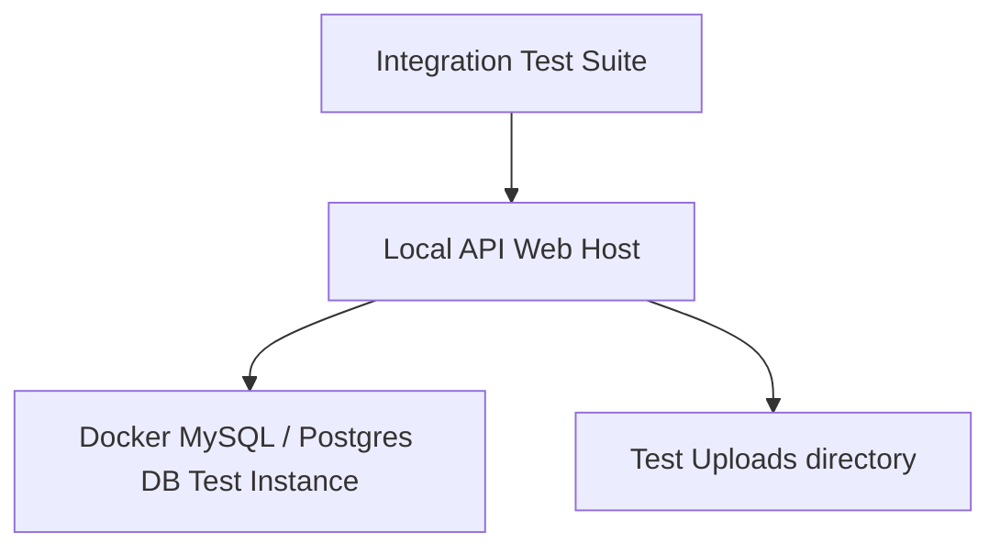

# Integration Testing Strategy

This document defines the integration testing protocols, database sandbox setup, API testing frameworks, and multi-module workflow validation scripts for FMDDS, based on Section 14 of the SRS.

---

## 1. Test Sandbox & Environment Setup

Unlike unit testing, integration tests execute against a real relational database, live file uploads repositories, and local API servers.

* **Database Isolation**: The test runner spins up a clean database instance inside a local Docker container before running tests.
* **Database State Reset**:
  * Run migrations on the test database before the test suite starts.
  * Truncate or reset transaction tables (`Case`, `Patient`, `Evidence`, `AuditLog`) after each test file executes to guarantee state isolation.
  * Re-populate lookup seeds (`Role`, `Permission`, `SeedData`) before each test.

---

## 2. API Integration Testing (HTTP Request/Response)

* **Frameworks**:
  * **Backend**: `Microsoft.AspNetCore.Mvc.Testing` (C#) or `Supertest` (Node.js).
  * **API Collections**: **Postman** test collections run in CI/CD pipelines via **Newman**.
* **Key Targets**:
  * JWT Bearer authentication headers parsing.
  * Request schema validation and HTTP error response payloads.
  * Correct persistence of records (asserting values exist in DB after PUT/POST).

---

## 3. Core Workflow Integration Scenarios

### 3.1 Case Intake and Registration Integration Scenario
* **Goal**: Validate data flow from client POST to database persistence.
* **Test Script**:
  1. POST to `/api/v1/patients` with a new NIC and demographic details.
  2. Assert response returns `201 Created` with a numeric `patientID`.
  3. POST to `/api/v1/cases` linking the new `patientID` and assigning a JMO.
  4. Assert response returns `201 Created` and a non-empty `caseNumber`.
  5. Query the test database directly: `SELECT * FROM Case WHERE CaseNumber = {returned_number}`.
  6. Assert database record contains correct `PatientID`, status is `Registered`, and an audit row was successfully created.

### 3.2 Postmortem Autopsy & Lab Result Workflow Integration Scenario
* **Goal**: Validate JMO autopsy logs, laboratory test requests, results recording, and report validations.
* **Test Script**:
  1. Register a postmortem case (Case status: `Registered`).
  2. Update status to `Assigned` and log an autopsy record using `/api/v1/cases/{id}/postmortem-exam` (Case status: `In Progress`).
  3. POST to `/api/v1/cases/{id}/lab-requests` requesting a toxicology screen (Case status: `Laboratory Pending`).
  4. PUT to `/api/v1/lab-requests/{requestId}/results` recording toxicological values.
  5. Assert request status is set to `Completed` and results link is created.
  6. POST to `/api/v1/cases/{id}/reports` creating a Draft PMR.
  7. PUT to `/api/v1/reports/{reportId}/approve` as JMO.
  8. Assert report status becomes `Approved` and case status transitions to `Closed` (verifies `BRL-004`).
